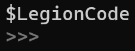
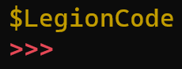
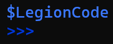

# Legion Code

  

### Legion Code is a powerful tool terminal working with files and directories.

# Features

- Auto open web links

- Help, Version, Change log in app

- Directory change

- Console commands

- Directory delete

- Delete files

- Info, Size, Rename files

- Directory view (Files, Folders)

- Console colors

- Text highlighted

- Partial git support

# Commands

<pre>

help              Display commands
.git              Open github
.source           Open LegionCode source
.bug              Open bugs website
cd                Directory change
cls               Clear terminal
version           Display current version
log               Change log
del dir           Delete current directory
size -f 'file'    Display file size from a directory
info -f 'file'    Display file details from a directory
del -f 'file'     Delete file from a directory
-r 'file_name' 'new_name'         Rename file from the directory
dir view          View directory content
dir -z            Go to previous directory
dir -x            Go to last directory
rand 'min' 'max'  Random number between min and max numbers we enter
compres 'file'    Create a .zip arhive with the file
code .            Open VS Code on the current directory
apps view         Display all apps that are installed on user PC
open 'app name'   Open a specific app
close 'app name'  Close a specific app
view 'file name'  Display the content of a file
stack 'link'      Store a link
.web              Open stores link
view stack        Display stored link
open 'link'       Open a link
delete stack      Delete stored link
temp              Clean temp files
arh -v 'name'     Display the content of an arhive
dir -o            Open directory in file explorer
set dark          Dark theme
set vulcan        Vulcan theme
set ocean         Ocean theme
set 0             Default theme
select 'file'     Stock file
transfer          Transfer stocked file to new directory
lc log            Display called commands
</pre>

## Git Supported Commands

[Git](https://git-scm.com/) download.

<pre>

git add .
git commit -m
git push
git clone
git pull
git status
git log
git checkout
git branch
</pre>

### For archive commands you need to install [7-Zip](https://www.7-zip.org/)

# Console view

Dark theme

Vulcan theme

Ocean theme

# Build

### This project use G++ compiler.
### If you don't know how G++ work go to [Build](doc/BUILD.md) doc.
### [G++](https://code.visualstudio.com/docs/cpp/config-mingw) download.
### [VS Code](https://code.visualstudio.com/) download.

# Soon

- [ ] Windows execution commands
- [x] Git support
- [x] Theme selection
- [x] Redesign help command
- [x] Open current directory in explorer
- [x] Transfer a file to a new directory
- [x] Copy a file and paste to a new directory
